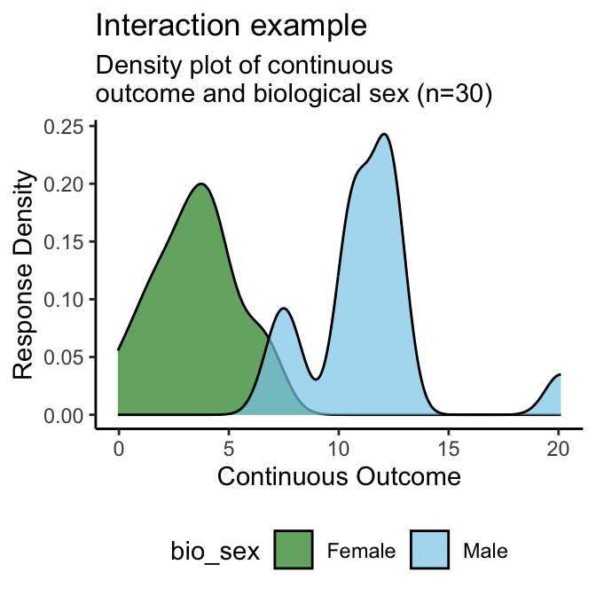
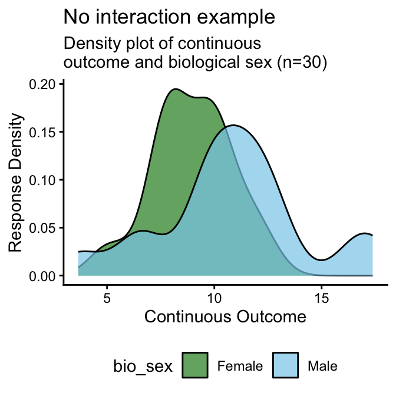
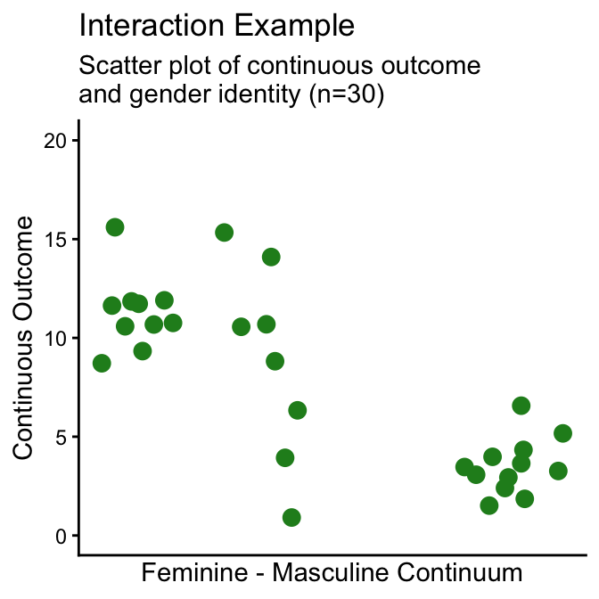
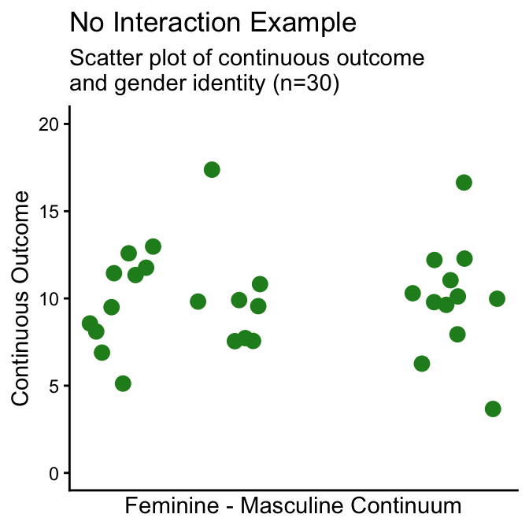
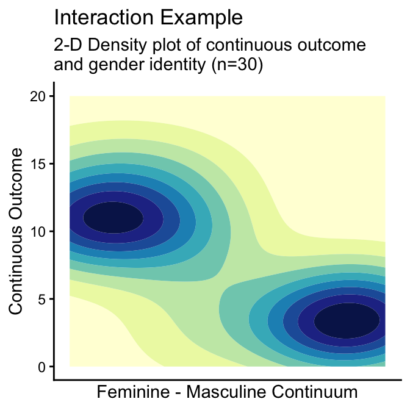
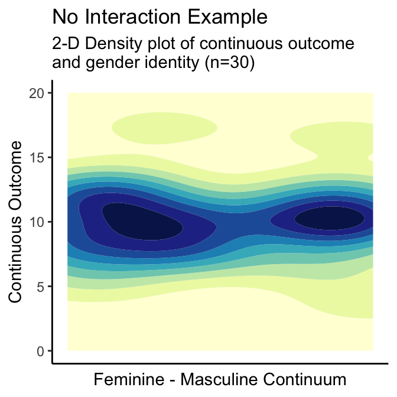
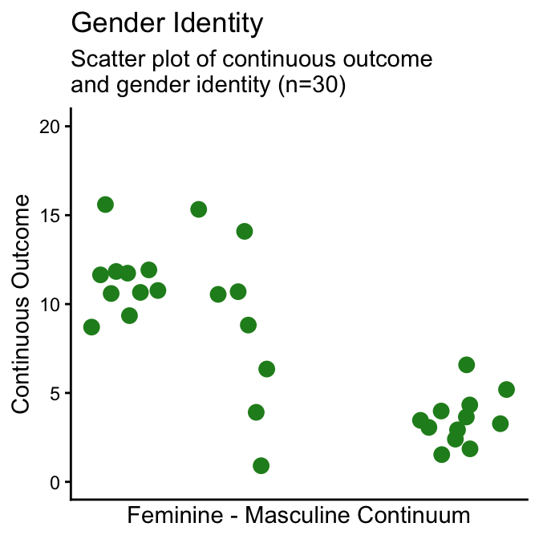
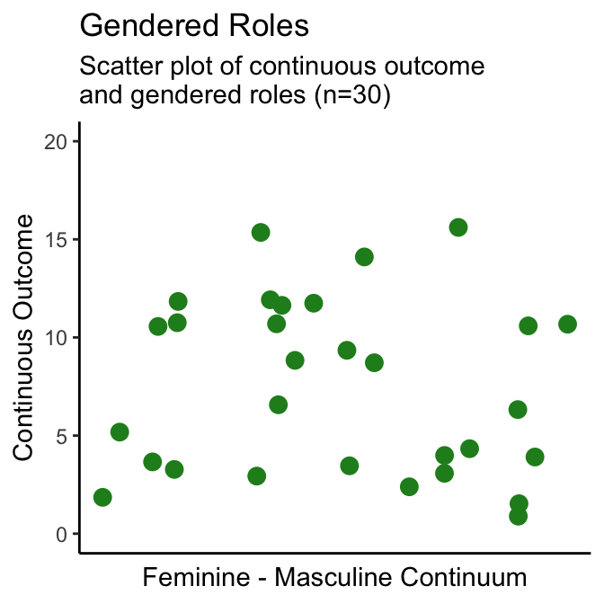
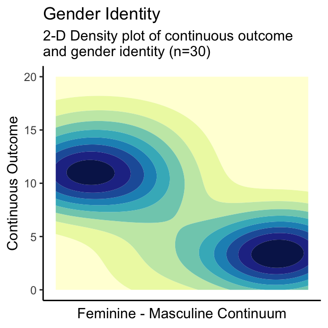
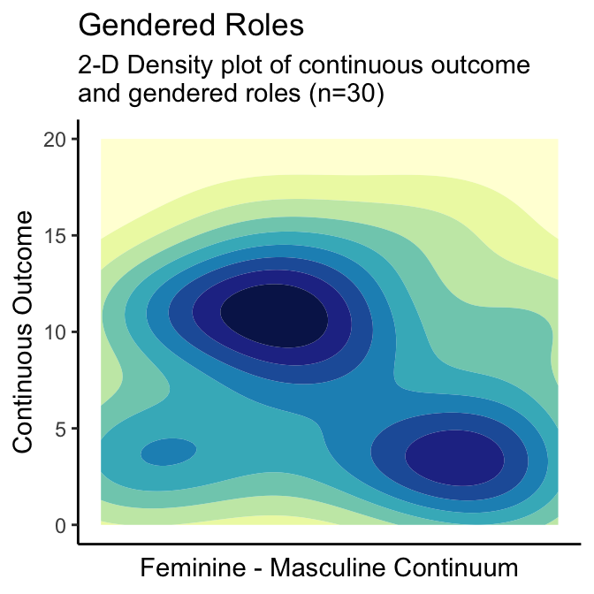

# SGBA of a Continuous Variable {#continuous}

> *Note: for the biological sex and single gendered aspect of health item examples, an example outcome variable that demonstrates a relationship between that variable and the SGBA-5 item being assessed - the interaction example - and an example that does not demonstrate a relationship between itself and the SGBA-5 item - the no interaction example - is shown.*

## Biological Sex

A good idea is to start by visualizing the continuous variable’s distribution disaggregated by sex like the density plot in Figure \@ref(fig:04-binary-pos-plot). Then calculate disaggregated summary statistics for the continuous variable disaggregated by sex (Tables \@ref(tab:03-tab-int) and \@ref(tab:03-tab-no-int)), and conduct a statistical test of difference in means (Welch’s t-test for this example).

### Density Plots by Biological Sex

(\#fig:04-binary-pos-plot)Density Plot of Continuous Variable by Biological Sex Examples

**Interpretation:** From the above density plots (Figure \@ref(fig:04-binary-pos-plot)) we can see a distinct overlap in the **no interaction example** which suggests that in that example's sample does not have a meaningful difference in the continuous outcome by sex. Conversely, the **interaction example** density plot has two distinct peaks which suggests that its sample's continuous outcome scores are associated with a participant's sex.

### Summary Statistics by Biological Sex

Table: (\#tab:03-tab-int)Interation example summary statisitics: Continuous outcome and biological sex

|biological sex |  n| mean continuous| SD continuous| median continuous| IQR continuous|
|:--------------|--:|---------------:|-------------:|-----------------:|--------------:|
|Female         | 14|             3.5|          1.94|                 4|              2|
|Male           | 16|            11.3|          2.95|                11|              2|

Table: (\#tab:03-tab-no-int)No interation example summary statisitics: Continuous outcome and biological sex

|biological sex |  n| mean continuous| SD continuous| median continuous| IQR continuous|
|:--------------|--:|---------------:|-------------:|-----------------:|--------------:|
|Female         | 14|             9.0|          1.84|                 9|              2|
|Male           | 16|            10.8|          3.47|                11|              3|

**Interpretation:** As with the density plots, we see that the standard deviations of the continuous variable for both males and females overlap in the **no interaction example** (Table \@ref(tab:03-tab-int)) - indicating a lack of significant difference by sex. The standard deviations of the continuous variable for both males and females do not overlap in the **interaction example** (Table \@ref(tab:03-tab-no-int)) - indicating a potential association between that continuous outcome variable and sex.

### Statistical Testing of Biological Sex: t-test

Next we will test the null hypothesis that biological sex does not have an impact on the continuous outcome variable being evaluated. Both the interaction example and no interaction example will be tested using a Welch's t-test at an alpha of .05.

> *Note: Using a Welch's t-test to test for statistically significant difference in these examples is a way, but by no means the only way in which this could be tested.*

Table: (\#tab:04-tab-ttest)Statistical test of difference: Continuous outcome and biological sex.

|Example        |Test           | T-score|95% CI         |   df| p-value|
|:--------------|:--------------|-------:|:--------------|----:|-------:|
|Interaction    |Welch's t-test |   -8.73|(-9.72, -6.02) | 26.1|   0.000|
|No interaction |Welch's t-test |   -1.80|(-3.85, 0.26)  | 23.4|   0.084|

**Interpretation:** Similarly to the descriptive table and density plots, we see that the **no interaction example** (Table \@ref(tab:04-tab-ttest)) does not show a significant difference by sex (T=-1.80, 95%CI=(-3.85,0.26), df=23.4, p-value\>0.08). The **interaction example** (Table \@ref(tab:04-tab-ttest)) shows a potential association between that continuous outcome variable and sex (T=-8.73, 95%CI=(-9.82,-6.02), df=23.4, p-value\<0.001), meriting further research into this potential interaction. This means that when reporting whether there was an association found between a continuous outcome and biological sex in the no interaction sample we can report that: [*"The no interaction sample did not show evidence that biological sex was associated with the continuous outcome in this study"*]{style="color:purple"}. Whereas the interaction sample, which did find a potential association, could report: [*"The interaction sample found statistically significant evidence that biological sex was associated with the continuous outcome in this study"*]{style="color:purple"}.

### Biological Sex: Interpretation Reporting Template

Below are example templates for reporting whether an outcome variable is associated with biological sex as categorized by the SGBA-5. Replace the words in the square brackets to complete.

> **If an association was found:**\
> In this study's sample we found that a person's self-reported biological sex at birth had a statistically significant association with \[continuous variable name]. More detailed investigation of this relationship is required to directly interpret the potential effects this interaction.

> **If an association was not found:**\
> In this study's sample we found that a person's self-reported biological sex at birth did not show a statistically significant association with \[continuous variable name].

## Gendered Aspects of Health: Assessing One Item

In this section we will analyze a single of the gendered aspects of health results from the SGBA-5 with a continuous variable of interest. Using the gender identity item as an example. First we will generate scatter (Figure \@ref(fig:04-gi-scatter) ) and 2D-density plots (Figure \@ref(fig:04-gi-2ddens)) of the continuous variable by the feminine-masculine continuum used in the SGBA-5. Then we shall calculate a Pearson correlation coefficient for that gendered aspect of health item and the continuous variable.

### Scatter & 2-D Density Plots for One Item

(\#fig:04-gi-scatter)Scatter Plot of Continuous Variable by Gender Identity

(\#fig:04-gi-2ddens)2D Density Plots of Continuous Variable by Gender Identity

**Interpretation:** From the above scatter and 2-D density plots (Figures \@ref(fig:04-gi-scatter) and \@ref(fig:04-gi-2ddens)) we can see no clear pattern difference in the continuous outcome value across the feminine-masculine continuum in the **no interaction example** (i.e., the continuous outcome values of participants who are closer to the feminine end of the continuum are not noticeably different than participants who are not closer to the feminine end of the continuum). This suggests that the **no interaction example** does not show a meaningful difference in the continuous outcome by gender identity within this sample. Conversely, the **interaction example** scatter and 2-D density plots show two distinct clusters with the cluster closer to the feminine end of the continuum having higher continuous outcome values than the cluster closer to the masculine end of the continuum. This suggests that the **interaction example** sample's continuous outcome scores are associated with participants' self-reported place on the SGBA-5's feminine-masculine gender identity continuum.

### Summary Statistics for One Gendered Apsect of Health Item

> *We do not recommend creating disaggregated summary statistics by any of the gendered aspects of health items from the SGBA-5. Analysis for effects associated with these variables can be conducted visually using plots (section \@ref(scatter-2-d-density-plots-for-one-item)) or through statistical testing (section \@ref(statistical-testing-for-one-item-pearsons-correlation-coefficient-r)).*

### Statistical Testing for One Item: Pearson's Correlation Coefficient (*r*)

Next we will test the null hypothesis that a participant's self-reported gender identity on a feminine-masculine continuum does not have an impact on the continuous outcome variable being evaluated. Both the interaction example and no interaction example will be tested by calculating Pearson's Correlation Coefficient and describing that coefficient's strength and direction (_but not the exact coefficient value_) as well as test for statistical significance of the correlation at an alpha of .05.

To be able to describe the strength of correlation between a continuous outcome and one of the gendered aspect of health variables, the authors suggest using a nominal classification of correlation strength. Using a nominal classification to interpret the strength of a correlation is inherently somewhat arbitrary, however, this trade-off can reduce potential misinterpretation that reporting a numerical coefficient value could cause. There maybe context- or discipline-specific guidelines for the interpretation of correlation strength which apply to your analysis. For the examples presented here, we will use the guidelines recommended in [_Statistical Power Analysis for the Behavioural Sciences_ (2013) by Jacob Cohen](https://doi.org/10.4324/9780203771587), which can be seen in Table \@ref(tab:04-cohen). 

_Please note that these suggested classification guidelines are arbitrary and may not be appropriate in all circumstances._ 

Table: (\#tab:04-cohen)Nominal Interpretations of Correlation Strength.

|Strength of Correlation |Positive Coefficient (r) |Negative Coefficient (r) |
|:-----------------------|:------------------------|:------------------------|
|None                    |0.0 to 0.1               |0.0 to -0.1              |
|Weak                    |0.1 to 0.3               |-0.1 to -0.3             |
|Moderate                |0.3 to 0.5               |-0.3 to -0.5             |
|Strong                  |0.5 to 1.0               |-0.5 to -1.0             |

__Note:__
Adapted from [_Statistical Power Analysis for the Behavioural Sciences_ (2013) by Jacob Cohen](https://doi.org/10.4324/9780203771587)

> *Note: Using Pearson's correlation coefficient to test for statistically significant difference in these examples is a way, but by no means the only way in which this could be tested.*

Table: (\#tab:04-tab-r)Statistical test of difference: Continuous outcome and Gender Idenity Item from the SGBA-5.

|Example        |Correlation Type |     r|95% CI        | df|Significance Test | T-score| p-value|
|:--------------|:----------------|-----:|:-------------|--:|:-----------------|-------:|-------:|
|Interaction    |Pearson's r      | -0.80|(-0.9, -0.61) | 28|t-test            |   -6.96|   0.000|
|No interaction |Pearson's r      |  0.02|(-0.34, 0.38) | 28|t-test            |    0.10|   0.922|

**Interpretation:** The correlation coefficient we see for the **no interaction example** (Table \@ref(tab:04-tab-r)) was 0.02. Using the classification criteria outlined in Table \@ref(tab:04-cohen), we see that the strength of correlation is "None". Thus, we can report that [*"The no interaction sample did not show evidence of correlation between the gender identity item and the continuous outcome"*]{style="color:purple"}. Similarly, we see that the **no interaction example**'s correlation does not meet the statistical significance threshold of 0.05 from the null hypothesis (T=0.10, df=28, p-value\>0.9). 

The **interaction example** shows a correlation coefficient of -0.80 (Table \@ref(tab:04-tab-r)), which falls under the "Strong" category of correlation strength from Table \@ref(tab:04-cohen). Therefore, we could report that [*"The interaction sample shows evidence of a strong correlation between the gender identity item and the continuous outcome"*]{style="color:purple"}. Similarly, we see that the **interaction example**'s correlation exceeds the statistical significance threshold of 0.05 from the null hypothesis (T=-6.96, df=28, p-value\<0.001). 

### Gendered Aspects of Health: One Item Interpretation Reporting Template

Below are example templates for reporting whether an outcome variable is associated with a gendered aspect of health as measured using the SGBA-5. Replace the words in the square brackets to complete.

> **If an association was found:**\
> In this study's sample we found that a person's self-reported \[gendered aspect of health item] had a statistically significant association with \[continuous variable name]. More detailed investigation of this relationship is required to directly interpret the potential effects this interaction.

> **If an association was not found:**\
> In this study's sample we found that a person's self-reported \[gendered aspect of health item] did not show a statistically significant association with \[continuous variable name].

## Gendered Aspects of Health: Assessing Multiple Items

In this section we will show how an example of how you can analyze multiple gendered aspects of health results from the SGBA-5 with a continuous variable of interest. (Specifically, this example will demonstrate a SGBA using the gender identity and gender roles items from the SGBA-5. However, the process for assessing 3 of or all 4 items with a continuous variable can be extended from this example). 

Like when assessing only one of the gendered aspect of health items, we will start by generating scatter (Figure \@ref(fig:04-2gah-scatter) ) and 2D-density plots (Figure \@ref(fig:04-2gah-2ddens)) of the continuous variable by the feminine-masculine continuum used in the SGBA-5. Then we shall calculate Pearson correlation coefficients between each gendered aspect of health item and the continuous variable.

### Scatter & 2-D Density Plots for Two Items

(\#fig:04-2gah-scatter)Scatter Plot of Continuous Variable by Gender Identity and Gendered Roles

(\#fig:04-2gah-2ddens)2D Density Plots of Continuous Variable by Gender Identityand Gendered Roles

**Interpretation:** From the above scatter and 2-D density plots (Figures \@ref(fig:04-2gah-scatter) and \@ref(fig:04-2gah-2ddens)) we can see a relatively clear pattern difference in the continuous outcome value across the feminine-masculine continuum in the **gender identity** item. Whereas, the **gendered roles** item scatter and 2-D density plots show less distinct clustering with a cluster closer to the masculine end of the continuum having lower continuous outcome values and the continuous outcome values closer to the feminine end of the continuum showing both high and low values. This suggests that in this example the **gender identity** SGBA-5 item is associated with the continuous outcome variable in this example and the **gendered roles** item is not clear, but may suggest the potential of a more complicated relationship between the continuous outcome and **gendered roles**.

### Summary Statistics for Two Items

> *As with assessing only one of the gendered aspects of health items from the SGBA-5, we do not recommend creating disaggregated summary statistics by any of the gendered aspects of health items from the SGBA-5. Analysis for effects associated with these variables can be conducted visually using plots (section \@ref(scatter-2-d-density-plots-for-two-items)) or through statistical testing (section \@ref(statistical-testing-for-two-items-pearsons-correlation-coefficient-r)).*

### Statistical Testing for Two Items: Pearson's Correlation Coefficient (*r*)

Next we will test the null hypothesis that a participant's self-reported gender identity or gendered roles on a feminine-masculine continuum do not impact the continuous outcome variable being evaluated. 

> *Note: typically when conducting multiple comparisons we adjust the threshold for statistical significance to account for those multiple comparisons (e.g., using a Bonferroni Correction for calculating p-value thresholds). In the the example below we do not use a multiple comparison correction. This is because the calculated correlation values are assumed to be approximately indicative of an underlying association rather than interpretable as exact values. However, __if you intend to look at SGBA-5 items in comparison to multiple primary variables in your analysis we highly recommend adjusting your significance thresholds for multiple comparisons.__*

Both the simulated gender identity and gendered roles SGBA-5 responses shown in the plots above will be tested for association with the continuous outcome variable by calculating Pearson's Correlation Coefficient and describing that coefficient's strength and direction (_but not the exact coefficient value_) as well as test for statistical significance of the correlation at an alpha of .05.

As described previously in section \@ref(statistical-testing-for-one-item-pearsons-correlation-coefficient-r), the authors suggest using a nominal classification of correlation strength. For the examples presented here, we will use the guidelines recommended in [_Statistical Power Analysis for the Behavioural Sciences_ (2013) by Jacob Cohen](https://doi.org/10.4324/9780203771587), which is summarized in Table \@ref(tab:04-cohen). 

> *Note: Using Pearson's correlation coefficient to test for statistically significant difference in these examples is a way, but by no means the only way in which this could be tested.*

Table: (\#tab:04-2gah-tab-r)Statistical test of difference: Continuous outcome by Gender Idenity and Gendered Roles Items from the SGBA-5.

|Example         |Correlation Type |    r|95% CI        | df|Significance Test | T-score| p-value|
|:---------------|:----------------|----:|:-------------|--:|:-----------------|-------:|-------:|
|Gender Identity |Pearson's r      | -0.8|(-0.9, -0.61) | 28|t-test            |   -6.96|   0.000|
|Gendered Roles  |Pearson's r      | -0.1|(-0.45, 0.27) | 28|t-test            |   -0.56|   0.582|

**Interpretation:** The **gender identity** item shows a correlation coefficient of -0.80 (Table \@ref(tab:04-2gah-tab-r)), which falls under the "Strong" category of correlation strength from Table \@ref(tab:04-cohen). Therefore, we could report that [*"Our testing found evidence of a strong correlation between the gender identity item and the continuous outcome"*]{style="color:purple"}. As we would expect given the strength of correlation, the **gender identity** item's correlation exceeds the statistical significance threshold of 0.05 from the null hypothesis (T=-6.96, df=28, p-value\<0.001). 

The correlation coefficient we see for the **gendered roles** item (Table \@ref(tab:04-2gah-tab-r)) was -0.1. Using the classification criteria outlined in Table \@ref(tab:04-cohen), we see that the strength of correlation is on the border between "None" and "Weak". Airing on the side of caution, we can report that [*"Our testing did not find clear evidence of correlation between the gendered roles item and the continuous outcome"*]{style="color:purple"}. Similarly, we see that the **gendered roles** item's correlation does not meet the statistical significance threshold of 0.05 from the null hypothesis (T=-0.56, df=28, p-value\>0.5). 

### Gendered Aspects of Health: Multiple Item Interpretation Reporting Template

Below are example templates for reporting whether an outcome variable is associated with gendered aspects of health as measured using the SGBA-5. Replace the words in the square brackets to complete.

> **If associations were found for all of the gendered aspect of health items assessed:**\
> In this study's sample we found that a person's self-reported \[gendered aspect of health items] demonstrated statistically significant associations with \[continuous variable name]. More detailed investigation of these relationships is required to directly interpret the potential effects these interactions.

> **If associations were found for at least one of the gendered aspect of health items assessed:**\
> In this study's sample we found that a person's self-reported \[gendered aspect of health items with association] demonstarted \[a] statistically significant association\[s] with \[continuous variable name], whereas a person's self-reported \[gendered aspect of health items with no association] did not. More detailed investigation of these relationships is required to directly interpret the potential effects these interactions.

> **If no association was found:**\
> In this study's sample we found that a person's self-reported \[gendered aspect of health items] did not show a statistically significant association with \[continuous variable name].
