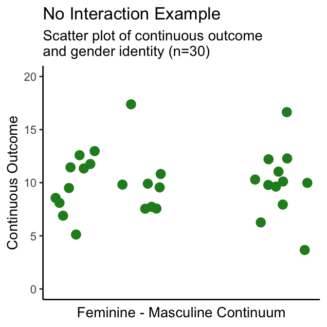

# SGBA of a Continuous Variable {#continuous}

> *Note 1: for conciseness, the following examples will only show results for two of the four gendered aspects of health items from the SGBA-5 (gender identity, and gender roles)*

> *Note 2: for each of the following sections, an example outcome variable that demonstrates a relationship between that variable and the SGBA-5 item being assessed - the interaction example - and an example that does not demonstrate a relationship between itself and the SGBA-5 item - the no interaction example - are shown.*

## Biological Sex

A good idea is to start by visualizing the continuous variable’s distribution disaggregated by sex like the density plot in Figure \@ref(fig:04-binary-pos-plot). Then calculate disaggregated summary statistics for the continuous variable disaggregated by sex (Tables \@ref(tab:03-tab-int) and \@ref(tab:03-tab-no-int)), and conduct a statistical test of difference in means (Welch’s t-test for this example).

### Density Plots by Biological Sex

(\#fig:04-binary-pos-plot)Density Plot of Continuous Variable by Biological Sex Examples

**Interpretation:** From the above density plots (Figure \@ref(fig:04-binary-pos-plot)) we can see a distinct overlap in the **no interaction example** which suggests that in that example's sample does not have a meaningful difference in the continuous outcome by sex. Conversely, the **interaction example** density plot has two distinct peaks which suggests that its sample's continuous outcome scores are associated with a participant's sex.

### Summary Statistics by Biological Sex

Table: (\#tab:03-tab-int)Interation example summary statisitics: Continuous outcome and biological sex

|biological sex |  n| mean continuous| SD continuous| median continuous| IQR continuous|
|:--------------|--:|---------------:|-------------:|-----------------:|--------------:|
|Female         | 14|             3.5|          1.94|                 4|              2|
|Male           | 16|            11.3|          2.95|                11|              2|

Table: (\#tab:03-tab-no-int)No interation example summary statisitics: Continuous outcome and biological sex

|biological sex |  n| mean continuous| SD continuous| median continuous| IQR continuous|
|:--------------|--:|---------------:|-------------:|-----------------:|--------------:|
|Female         | 14|             9.0|          1.84|                 9|              2|
|Male           | 16|            10.8|          3.47|                11|              3|

**Interpretation:** As with the density plots, we see that the standard deviations of the continuous variable for both males and females overlap in the **no interaction example** (Table \@ref(tab:03-tab-int)) - indicating a lack of significant difference by sex. The standard deviations of the continuous variable for both males and females do not overlap in the **interaction example** (Table \@ref(tab:03-tab-no-int)) - indicating a potential association between that continuous outcome variable and sex.

### Statistical Testing of Biological Sex: t-test

Next we will test the null hypothesis that biological sex does not have an impact on the continuous outcome variable being evaluated. Both the interaction example and no interaction example will be tested using a Welch's t-test at an alpha of .05.

> *Note: Using a Welch's t-test to test for statistically significant difference in these examples is a way, but by no means the only way in which this could be tested.*

Table: (\#tab:04-tab-ttest)Statistical test of difference: Continuous outcome and biological sex.

|Example        |Test           | T-score|95% CI         |   df| p-value|
|:--------------|:--------------|-------:|:--------------|----:|-------:|
|Interaction    |Welch's t-test |   -8.73|(-9.72, -6.02) | 26.1|   0.000|
|No interaction |Welch's t-test |   -1.80|(-3.85, 0.26)  | 23.4|   0.084|

**Interpretation:** Similarly to the descriptive table and density plots, we see that the **no interaction example** (Table \@ref(tab:04-tab-ttest)) does not show a significant difference by sex (T=-1.80, 95%CI=(-3.85,0.26), df=23.4, p-value\>0.08). The **interaction example** (Table \@ref(tab:04-tab-ttest)) shows a potential association between that continuous outcome variable and sex (T=-8.73, 95%CI=(-9.82,-6.02), df=23.4, p-value\<0.001), meriting further research into this potential interaction. This means that when reporting whether there was an association found between a continuous outcome and biological sex in the no interaction sample we can report that: [*"The no interaction sample did not show evidence that biological sex was associated with the continuous outcome in this study"*]{style="color:purple"}. Whereas the interaction sample, which did find a potential association, could report: [*"The interaction sample found statistically significant evidence that biological sex was associated with the continuous outcome in this study"*]{style="color:purple"}.

### Biological Sex: Interpretation Reporting Template

Below are example templates for reporting whether an outcome variable is associated with biological sex as categorized by the SGBA-5. Replace the words in the square brackets to complete.

> **If an association was found:**\
> In this study's sample we found that a person's self-reported biological sex at birth had a statistically significant association with [continuous variable name]. More detailed investigation of this relationship is required to directly interpret the potential effects this interaction.

> **If an association was not found:**\
> In this study's sample we found that a person's self-reported biological sex at birth did not show a statistically significant association with [continuous variable name].

## Gendered Aspects of Health: Gender Identity

In this section we will analyze the gendered aspects of health results from the SGBA-5 with a continuous variable of interest. First we will generate scatter (Figure \@ref(fig:04-gi-scatter) ) and 2D-density plots (Figure \@ref(fig:04-gi-2ddens)) of the continuous variable by the feminine-masculine continuum used in the SGBA-5. Then we shall calculate a Pearson correlation coefficient between each gendered aspect of health item and the continuous variable.

### Scatter & 2-D Density Plots by Gender Identity

(\#fig:04-gi-scatter)Scatter Plot of Continuous Variable by Gender Identity

(\#fig:04-gi-2ddens)2D Density Plots of Continuous Variable by Gender Identity

**Interpretation:** From the above scatter and 2-D density plots (Figures \@ref(fig:04-gi-scatter) and \@ref(fig:04-gi-2ddens)) we can see no clear pattern difference in the continuous outcome value across the feminine-masculine continuum in the **no interaction example** (i.e., the continuous outcome values of participants who are closer to the feminine end of the continuum are not noticeably different than participants who are not closer to the feminine end of the continuum). This suggests that the **no interaction example** does not show a meaningful difference in the continuous outcome by gender identity within this sample. Conversely, the **interaction example** scatter and 2-D density plots show two distinct clusters with the cluster closer to the feminine end of the continuum having higher continuous outcome values than the cluster closer to the masculine end of the continuum. This suggests that the **interaction example** sample's continuous outcome scores are associated with participants' self-reported place on the SGBA-5's feminine-masculine gender identity continuum.

### Summary Statistics by Gender Identity

> *We do not recommend creating disaggregated summary statistics by any of the gendered aspects of health items from the SGBA-5. Analysis for effects associated with these variables can be conducted visually using plots (section \@ref(scatter-2-d-density-plots-by-gender-identity)) or through statistical testing (section \@ref(statistical-testing-of-gender-identity-pearsons-correlation-coefficient-r)).*

### Statistical Testing of Gender Identity: Pearson's Correlation Coefficient (*r*)

Next we will test the null hypothesis that a participant's self-reported gender identity on a feminine-masculine continuum does not have an impact on the continuous outcome variable being evaluated. Both the interaction example and no interaction example will be tested by calculating Pearson's Correlation Coefficient and describing that coefficient's strength and direction (_but not the exact coefficient value_) as well as test for statistical significance of the correlation at an alpha of .05.

To be able to describe the strength of correlation between a continuous outcome and one of the gendered aspect of health variables, the authors suggest using a nominal classification of correlation strength. Using a nominal classification to interpret the strength of a correlation is inherently somewhat arbitrary, however this trade-off can reduce potential misinterpretation that reporting a numerical coefficient value could cause. There maybe context- or discipline-specific guidelines for the interpretation of correlation strength which apply to your analysis. For the examples presented here, we will use the guidelines recommended in [_Statistical Power Analysis for the Behavioural Sciences_ (2013) by Jacob Cohen](https://doi.org/10.4324/9780203771587), which can be seen in Table \@ref(tab:04-cohen). 

_Please note that these suggested classification guidelines are arbitrary and may not be appropriate in all circumstances._ 

Table: (\#tab:04-cohen)Nominal Interpretations of Correlation Strength.

|Strength of Correlation |Positive Correlation Coefficient (r) |Negative Correlation Coefficient (r) |
|:-----------------------|:------------------------------------|:------------------------------------|
|None                    |0.0 to 0.1                           |0.0 to -0.1                          |
|Small                   |0.1 to 0.3                           |-0.1 to -0.3                         |
|Medium                  |0.3 to 0.5                           |-0.3 to -0.5                         |
|Large                   |0.5 to 1.0                           |-0.5 to -1.0                         |

__Note:__
Adapted from [_Statistical Power Analysis for the Behavioural Sciences_ (2013) by Jacob Cohen](https://doi.org/10.4324/9780203771587)

Note: Using Pearson's correlation coefficient to test for statistically significant difference in these examples is a way, but by no means the only way in which this could be tested.

Table: (\#tab:04-tab-r)Statistical test of difference: Continuous outcome and Gender Idenity Item from the SGBA-5.

|Example        |Correlation Type |     r|95% CI        | df|Significance Test | T-score| p-value|
|:--------------|:----------------|-----:|:-------------|--:|:-----------------|-------:|-------:|
|Interaction    |Pearson's r      | -0.80|(-0.9, -0.61) | 28|t-test            |   -6.96|   0.000|
|No interaction |Pearson's r      |  0.02|(-0.34, 0.38) | 28|t-test            |    0.10|   0.084|

**Interpretation:** The correlation coefficient we see for the **no interaction example** (Table \@ref(tab:04-tab-r)) was 0.02. Using the classification criteria outlined in Table \@ref(tab:04-cohen), we see that the strength of correlation is "none". Thus, we can report that [*"The no interaction sample did not show evidence of correlation between the gender identity item and the continuous outcome"*]{style="color:purple"}. Similarly, we see that the **no interaction example**'s correlation does not meet the statistical significance threshold of 0.05 from the null hypothesis (T=0.10, df=28, p-value\>0.08). 

