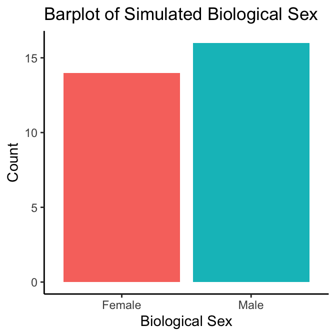
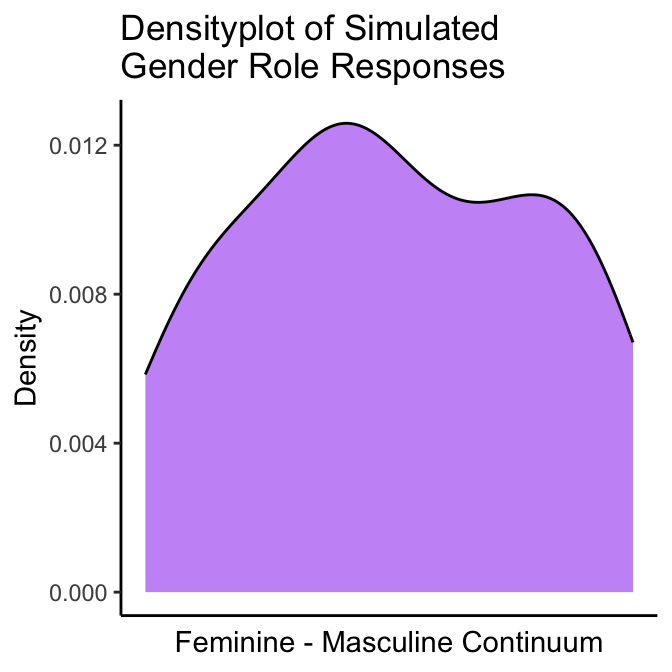

# Descriptive Analysis {#descriptive-analysis}

> *Note: for conciseness, the following examples will only show results for two of the four gendered aspects of health items from the SGBA-5 (gender identity, and gender roles)*

## Visualize Distribution of SGBA-5 Responses

In plot \@ref(fig:02-univar-sex-plot) we see that there are more participants who report their **biological sex** as assigned as female at birth (n=18) than males (n=12). 

(\#fig:02-univar-sex-plot)Barplot of Biological Sex Responses

Looking at the density plots for **gender identity** and **gender role** (figure \@ref(fig:02-univar-gi-plot)), we see that while both variables are bimodal, the **gender identity** responses is more strongly bimodal with one peak closer to the feminine side of the feminine-masculine continuum and one peak closer to masculine end of that continuum. Further, we can also see that in general, participants reported their **gender identity** and **roles** as being more feminine, again with the **gender identity** responses showing this trend more strongly than the **gender role** responses.  

(\#fig:02-univar-gi-plot)Density plots of Gender Identity and Roles

Presently, there is _**no consensus on what descriptive statistics are most appropriate to report bimodal variables in health research**_ (the typical mean(sd) or median(IQR) will not accurately represent that there is more than one peak in a bimodal variable’s frequency distribution). When taken alongside the SGBA-5’s assumption that the feminine-masculine continuum doesn’t have a true 0 value, it is our suggestion that _**if researchers decide to report a
single variable descriptive statistic for the gendered aspects of health item responses from the SGBA-5, they should provide a nominal description of skew**_ along the feminine-masculine continuum as their descriptive statistic rather than the numerical average (or other summary statistic). To determine skew of one of the gender variables, the authors suggest calculating the sample’s mean score along the feminine-masculine continuum and then classifying the skew using the classifications described in Table \@ref(tab:02-tab). Please note that these suggested classification guidelines are arbitrary and may not be appropriate in all circumstances.   

Table: (\#tab:02-tab)Potential Interpretation of Sample Means for Gendered Aspect of Health Items.

|Mean     |Interpretation                 |
|:--------|:------------------------------|
|>70      |"Skews masculine"              |
|55 to 70 |"More masculine than feminine" |
|45 to 55 |"Not strongly skewed"          |
|30 to 45 |"More feminine than masculine" |
|<30      |"Skews feminine"               |

__Note:__
This table assumes you have recorded the gendered aspects of health items as 0 being the most feminine score and 100 being the most masculine score.

For the simulated dataset represented in the density plots above, the mean score for the **gender identity** item was 50.2 and 46.8 for the **gender role** item. This means that when reporting descriptive statistics on the simulated sample we could report that: “*On the whole, the simulated
sample was not strongly skewed on a feminine to masculine continuum for either the gender identity or gender role measures from the SGBA-5*”. 

Taking all these together, an example of a sample characteristics table of the SGBA-5 items in the simulated dataset could be presented as has been displayed in Table \@ref(tab:02-tab02)

Table: (\#tab:02-tab02)Simulated sample characteristics.

|SGBA Item                        |Sample (n = 30)     |
|:--------------------------------|:-------------------|
|Biological Sex (n(%))            |                    |
|__Female                         |14(47%)             |
|__Intersex                       |NA                  |
|_Male                            |16(53%)             |
|Gendered Aspect of Health (skew) |                    |
|__Gender Identity                |Not strongly skewed |
|__Gendered Roles                 |Not strongly skewed |
