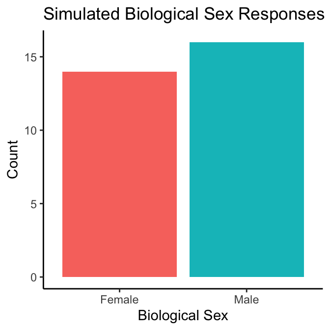

# About

The example analyses presented in this document are a demonstration of how sex-and gender-based analysis (SGBA) can be conducted using results from the Sex- and Gender-Based Analysis Tool – 5 item (SGBA-5) by Putman and Dogra [DOI].

The examples do not cover all potential analyses that could be done using the SGBA-5 but does provide a solid foundation from which researchers can select from and build upon.

## Further Resources

More information on the SGBA-5, instructions for its use, and rationale for are included in the SGBA-5’s documentation [SUPPLEMENTARY MATERIAL URL]. Initial reliability and validity testing of the SGBA-5 are reported in the paper by Putman, Cole, & Dogra [DOI] and in A Putman's [thesis work](https://ontariotechu.scholaris.ca/items/fddf2667-8cd6-429d-85bd-74b0076ab561).

<!--chapter:end:index.Rmd-->

# Data Structure {#data-structure}

## Collected SGBA-5 Responses

After collecting responses from the SGBA-5 you will have a dataset that looks something like this:


```
## ── Attaching core tidyverse packages ──────────────────────── tidyverse 2.0.0 ──
## ✔ dplyr     1.1.4     ✔ readr     2.1.5
## ✔ forcats   1.0.0     ✔ stringr   1.5.1
## ✔ ggplot2   3.5.1     ✔ tibble    3.2.1
## ✔ lubridate 1.9.3     ✔ tidyr     1.3.1
## ✔ purrr     1.0.2     
## ── Conflicts ────────────────────────────────────────── tidyverse_conflicts() ──
## ✖ dplyr::filter() masks stats::filter()
## ✖ dplyr::lag()    masks stats::lag()
## ℹ Use the conflicted package (<http://conflicted.r-lib.org/>) to force all conflicts to become errors
```


Table: (\#tab:01-data)Example Data Structure

| pt_id|sex    | gen_id| gen_exp| gen_role| gen_rel|
|-----:|:------|------:|-------:|--------:|-------:|
|     1|Female |     48|      99|       70|      25|
|     2|Male   |    100|      17|       99|       2|
|     3|Female |     64|      48|       88|      40|
|     4|Female |     24|      46|       36|      88|
|     5|Male   |     73|      23|       19|      26|

__Note:__
The values in this table are placeholders for the example, not real data

Where:  

`pt_id` is the participant identifier.  

`sex` is the SGBA-5 categorical Biological Sex item.  

  - response options of "male", "female", and "intersex".  

`gen_id` is the SGBA-5 Gender Identity gendered aspect of health item.  

  - Responses are recorded as ordinal values between 0 to 100 on a feminine to masculine scale (measured in mm if completed on paper).  

`gen_exp` is the SGBA-5 Gender Expression gendered aspect of health item.  

  - Responses are recorded as ordinal values between 0 to 100 on a feminine to masculine scale (measured in mm if completed on paper).  

`gen_role` is the SGBA-5 Gender Role gendered aspect of health item.  

  - Responses are recorded as ordinal values between 0 to 100 on a feminine to masculine scale (measured in mm if completed on paper).  

`gen_rel` is the SGBA-5 Gender Relations gendered aspect of health item.  

  - Responses are recorded as ordinal values between 0 to 100 on a feminine to masculine scale (measured in mm if completed on paper).


## Simulated Data

This example analysis uses simulated data, if you wish to replicate the simulate data the code to do so is included in [Appendix A]() or can be downloaded from this example's [github page](https://github.com/putman-a/SGBA-5_example_analysis).

<!--chapter:end:01-data-structures.Rmd-->

# Descriptive Analysis {#descriptive-analysis}


> *Note: for conciseness, the following examples will only show results for two of the four gendered aspects of health items from the SGBA-5 (gender identity, and gender roles)*


## Visualize Distribution of SGBA-5 Responses

In plot \@ref(fig:02-univar-sex-plot) we see that there are more participants who report their **biological sex** as assigned as female at birth (n=18) than males (n=12). 

<div class="figure" style="text-align: center">

<p class="caption">(\#fig:02-univar-sex-plot)Barplot of Biological Sex Responses</p>
</div>

Looking at the density plots for **gender identity** and **gender role** (figure \@ref(fig:02-univar-gi-plot)), we see that while both variables are bimodal, the **gender identity** responses is more strongly bimodal with one peak closer to the feminine side of the feminine-masculine continuum and one peak closer to masculine end of that continuum. Further, we can also see that in general, participants reported their **gender identity** and **roles** as being more feminine, again with the **gender identity** responses showing this trend more strongly than the **gender role** responses.  

<div class="figure" style="text-align: center">

<p class="caption">(\#fig:02-univar-gi-plot)Density plots of Gender Identity and Roles</p>
</div>

Presently, there is _**no consensus on what descriptive statistics are most appropriate to report bimodal variables in health research**_ (the typical mean(sd) or median(IQR) will not accurately represent that there is more than one peak in a bimodal variable’s frequency distribution). When taken alongside the SGBA-5’s assumption that the feminine-masculine continuum doesn’t have a true 0 value, it is our suggestion that _**if researchers decide to report a
single variable descriptive statistic for the gendered aspects of health item responses from the SGBA-5, they should provide a nominal description of skew**_ along the feminine-masculine continuum as their descriptive statistic rather than the numerical average (or other summary statistic). To determine skew of one of the gender variables, the authors suggest calculating the sample’s mean score along the feminine-masculine continuum and then classifying the skew using the classifications described in Table \@ref(tab:02-tab). Please note that these suggested classification guidelines are arbitrary and may not be appropriate in all circumstances.   


Table: (\#tab:02-tab)Potential Interpretation of Sample Means for Gendered Aspect of Health Items.

|Mean     |Interpretation                 |
|:--------|:------------------------------|
|>70      |"Skews masculine"              |
|55 to 70 |"More masculine than feminine" |
|45 to 55 |"Not strongly skewed"          |
|30 to 45 |"More feminine than masculine" |
|<30      |"Skews feminine"               |

__Note:__
This table assumes you have recorded the gendered aspects of health items as 0 being the most feminine score and 100 being the most masculine score.

For the simulated dataset represented in the density plots above, the mean score for the **gender identity** item was 50.2 and 46.8 for the **gender role** item. This means that when reporting descriptive statistics on the simulated sample we could report that: “*On the whole, the simulated
sample was not strongly skewed on a feminine to masculine continuum for either the gender identity or gender role measures from the SGBA-5*”. 

Taking all these together, an example of a sample characteristics table of the SGBA-5 items in the simulated dataset could be presented as has been displayed in Table \@ref(tab:02-tab02)


Table: (\#tab:02-tab02)Simulated sample characteristics.

|SGBA Item                        |Sample (n = 30)     |
|:--------------------------------|:-------------------|
|Biological Sex (n(%))            |                    |
|__Female                         |14(47%)             |
|__Intersex                       |NA                  |
|_Male                            |16(53%)             |
|Gendered Aspect of Health (skew) |                    |
|__Gender Identity                |Not strongly skewed |
|__Gendered Roles                 |Not strongly skewed |

<!--chapter:end:02-descriptive-analysis.Rmd-->


# Appendix {-}


## Simulated Data Creation

Below is the code used to create the simulated data that will be used to create the example SGBA seen throughout the rest of this example analysis.


``` r
# load libraries ----------------------------------------------------------
library(tidyverse)
```

```
## ── Attaching core tidyverse packages ──────────────────────── tidyverse 2.0.0 ──
## ✔ dplyr     1.1.4     ✔ readr     2.1.5
## ✔ forcats   1.0.0     ✔ stringr   1.5.1
## ✔ ggplot2   3.5.1     ✔ tibble    3.2.1
## ✔ lubridate 1.9.3     ✔ tidyr     1.3.1
## ✔ purrr     1.0.2     
## ── Conflicts ────────────────────────────────────────── tidyverse_conflicts() ──
## ✖ dplyr::filter() masks stats::filter()
## ✖ dplyr::lag()    masks stats::lag()
## ℹ Use the conflicted package (<http://conflicted.r-lib.org/>) to force all conflicts to become errors
```

``` r
# set seed for predictability
set.seed(42, kind = "Mersenne-Twister")

# write simulation functions ----------------------------------------------

# function for simulating bimodal gender variables
binom_bounded <- function(
    n, prop, mean1, sd1, mean2, sd2, lim_low = -Inf, lim_up = Inf, round
    ){
  # error checking
  if(prop > 1 || prop< 0){stop("binomial proportion should be between 0 and 1")}
  if(n < 1){stop("n must be greater than or equal to 1")}
  if(sd1 < 0 || sd2 < 0){stop("standard deviations must be non-negative")}
  # create index
  index <- rbinom(n, size = 1, prob = prop)
  # simulate each peak using a bounded `rnorm()`
  binom_sim1 <- index * qnorm(
    runif(
      n, pnorm(lim_low, mean1, sd1), pnorm(lim_up, mean1, sd1)
      ), 
    mean1, sd1)
  binom_sim0 <- (1 - index) * qnorm(
    runif(
      n, pnorm(lim_low, mean2, sd2), pnorm(lim_up, mean2, sd2)
      ), 
    mean2, sd2)
  binom_sim <- binom_sim0 + binom_sim1
  binom_sim <- round(binom_sim, round)
  binom_sim
}


# function for simulating Likert/ordinal outcome variable
ordinal_sim <- function(
    n, mean, sd, lim_low = -Inf, lim_up = Inf
    ){
  ord_sim <- qnorm(
    runif(
      n, pnorm(lim_low, mean, sd), pnorm(lim_up, mean, sd)
      ),
    mean, sd)
  ord_sim <- round(ord_sim, 0)
  ord_sim
}


# simulate SGBA-5 data with n of 30 -------------------------------------

# biological sex: categorical (female, intersex, male)
bio_sex <- factor(
  sample(c('Female', 'Male'), 30, replace=TRUE, prob=c(0.6, 0.4)),
  )

# gender identity: ordered (0 [feminine] to 100 [masculine])
gen_id <- binom_bounded(
  n = 30, prop = 0.6, mean1 = 20, sd1 = 20, mean2 = 85, sd2 = 15, lim_low = 0,
  lim_up = 100, round = 0
)

# gender role: ordered (0 [feminine] to 100 [masculine])
gen_role <- binom_bounded(
  n = 30, prop = 0.6, mean1 = 25, sd1 = 20, mean2 = 80, sd2 = 20, lim_low = 0,
  lim_up = 100, round = 0
)


# simulate example positive outcome data with n of 30 -----------------------

## simulated numerical outcome: --------------------------------------------

# by sex: males (mean = 12, SD = 3), females (mean = 4, sd = 2)
outcome_num_pos_m <- rnorm(n = 16, mean = 12, sd = 3)
outcome_num_pos_f <- rnorm(n = 14, mean = 4, sd = 2)
outcome_num_pos_sex <- c(outcome_num_pos_f, outcome_num_pos_m)

# by g_id: high (mean = 12, SD = 3), low (mean = 4, sd = 2)
outcome_num_pos_gid_high <- rnorm(n = 15, mean = 12, sd = 3)
outcome_num_pos_gid_low <- rnorm(n = 15, mean = 4, sd = 2)
outcome_num_pos_gid <- c(outcome_num_pos_gid_high, outcome_num_pos_gid_low)

# by g_role: high (mean = 12, SD = 3), low (mean = 4, sd = 2)
outcome_num_pos_grol_high <- rnorm(n = 12, mean = 12, sd = 3)
outcome_num_pos_grol_low <- rnorm(n = 18, mean = 7, sd = 2)
outcome_num_pos_grol <- c(outcome_num_pos_grol_high, outcome_num_pos_grol_low)


## simulated Likert outcome: ---------------------------------------------

# by sex males (mean = 2, SD = 1), females (mean = 5, sd = 2)
outcome_ord_pos_m <- ordinal_sim(
  n = 16, mean = 2, sd = 1, lim_low = 1, lim_up = 7
)
outcome_ord_pos_f <- ordinal_sim(
  n = 14, mean = 5, sd = 1, lim_low = 1, lim_up = 7
)
outcome_ord_pos_sex <- c(outcome_ord_pos_f, outcome_ord_pos_m) %>%
  factor(., levels = c(1,2,3,4,5,6,7), ordered = TRUE)


# by g_id: high (mean = 5, SD = 2), low (mean = 1, sd = 2)
outcome_ord_pos_high <- ordinal_sim(
  n = 15, mean = 5, sd = 2, lim_low = 1, lim_up = 7
)
outcome_ord_pos_low <- ordinal_sim(
  n = 15, mean = 1, sd = 2, lim_low = 1, lim_up = 7
)
outcome_ord_pos_gid <- c(outcome_ord_pos_high, outcome_ord_pos_low) %>%
  factor(., levels = c(1,2,3,4,5,6,7), ordered = TRUE)


# by g_role: high (mean = 5, SD = 2), low (mean = 1, sd = 2)
outcome_ord_pos_high <- ordinal_sim(
  n = 12, mean = 5, sd = 2, lim_low = 1, lim_up = 7
)
outcome_ord_pos_low <- ordinal_sim(
  n = 18, mean = 1, sd = 2, lim_low = 1, lim_up = 7
)
outcome_ord_pos_grol <- c(outcome_ord_pos_high, outcome_ord_pos_low) %>%
  factor(., levels = c(1,2,3,4,5,6,7), ordered = TRUE)


## simulated binary outcome: -----------------------------------------------

# by sex males (yes = .2, no = .8), females (yes = .8, no = .2)
outcome_bin_pos_m <- sample(
  c('yes','no'), 16, replace = TRUE, prob = c(.2, .8)
)
outcome_bin_pos_f <- sample(
  c('yes','no'), 14, replace = TRUE, prob = c(.8, .2)
)
outcome_bin_pos_sex <- append(outcome_bin_pos_f, outcome_bin_pos_m) %>%
  factor()


# by g_id: high (yes = .4, no = .6), low (yes = .8, no = .2)
outcome_bin_pos_high <- sample(
  c('yes','no'), 15, replace = TRUE, prob = c(.4, .6)
)
outcome_bin_pos_low <- sample(
  c('yes','no'), 15, replace = TRUE, prob = c(.8, .2)
)
outcome_bin_pos_gid <- append(outcome_bin_pos_high, outcome_bin_pos_low) %>%
  factor()


# by g_rol: high (yes = .3, no = .5), low (yes = .8, no = .2)
outcome_bin_pos_high <- sample(
  c('yes','no'), 12, replace = TRUE, prob = c(.3, .7)
)
outcome_bin_pos_low <- sample(
  c('yes','no'), 18, replace = TRUE, prob = c(.8, .2)
)
outcome_bin_pos_grol <- append(outcome_bin_pos_high, outcome_bin_pos_low) %>%
  factor()


# simulate example negative outcome data with n of 30 -----------------------

# simulated numerical outcome: continuous (mean = 10, SD = 3)
outcome_num_neg <- rnorm(n = 30, mean = 10, sd = 3)

# simulated Likert outcome: 7-point Likert scale (mean = 4, SD = 2)
outcome_ord_neg <- ordinal_sim(
  n = 30, mean = 4, sd = 2, lim_low = 1, lim_up = 7
)

# simulated binary outcome: categorical (yes, no)
outcome_bin_neg <- factor(
  sample(c('yes','no'), 30, replace = TRUE, prob = c(0.67, 0.33))
)


# create example data frame -----------------------------------------------

# combine into dataframe
sim_data <- tibble(
  bio_sex, gen_id, gen_role, #outcome_bin_pos, 
  outcome_num_neg, outcome_ord_neg, outcome_bin_neg
  ) %>% arrange(., bio_sex) %>% 
  cbind(., outcome_num_pos_sex) %>%
  cbind(., outcome_ord_pos_sex) %>%
  cbind(., outcome_bin_pos_sex) %>%
  arrange(., gen_id) %>% 
  cbind(., outcome_num_pos_gid) %>% 
  cbind(., outcome_ord_pos_gid) %>%
  cbind(., outcome_bin_pos_gid) %>%
  arrange(., gen_role) %>% 
  cbind(., outcome_num_pos_grol) %>% 
  cbind(., outcome_ord_pos_grol) %>%
  cbind(., outcome_bin_pos_grol)


# save simulated df
write_csv(sim_data, file = "sim-data.csv")
```

### Session Info for Data Creation


``` r
sessioninfo::session_info(pkgs = "loaded")
```

```
## ─ Session info ───────────────────────────────────────────────────────────────
##  setting  value
##  version  R version 4.4.1 (2024-06-14)
##  os       macOS Sonoma 14.5
##  system   aarch64, darwin20
##  ui       X11
##  language (EN)
##  collate  en_US.UTF-8
##  ctype    en_US.UTF-8
##  tz       America/Toronto
##  date     2024-08-09
##  pandoc   3.1.11 @ /Applications/RStudio.app/Contents/Resources/app/quarto/bin/tools/aarch64/ (via rmarkdown)
## 
## ─ Packages ───────────────────────────────────────────────────────────────────
##  package     * version    date (UTC) lib source
##  bit           4.0.5      2022-11-15 [1] CRAN (R 4.4.0)
##  bit64         4.0.5      2020-08-30 [1] CRAN (R 4.4.0)
##  bookdown      0.40       2024-07-02 [1] CRAN (R 4.4.0)
##  bslib         0.7.0      2024-03-29 [1] CRAN (R 4.4.0)
##  cachem        1.1.0      2024-05-16 [1] CRAN (R 4.4.0)
##  cli           3.6.3      2024-06-21 [1] CRAN (R 4.4.0)
##  colorspace    2.1-0      2023-01-23 [1] CRAN (R 4.4.0)
##  crayon        1.5.3      2024-06-20 [1] CRAN (R 4.4.0)
##  digest        0.6.36     2024-06-23 [1] CRAN (R 4.4.0)
##  dplyr       * 1.1.4      2023-11-17 [1] CRAN (R 4.4.0)
##  evaluate      0.24.0     2024-06-10 [1] CRAN (R 4.4.0)
##  fansi         1.0.6      2023-12-08 [1] CRAN (R 4.4.0)
##  fastmap       1.2.0      2024-05-15 [1] CRAN (R 4.4.0)
##  forcats     * 1.0.0      2023-01-29 [1] CRAN (R 4.4.0)
##  generics      0.1.3      2022-07-05 [1] CRAN (R 4.4.0)
##  ggplot2     * 3.5.1      2024-04-23 [1] CRAN (R 4.4.0)
##  glue          1.7.0      2024-01-09 [1] CRAN (R 4.4.0)
##  gtable        0.3.5      2024-04-22 [1] CRAN (R 4.4.0)
##  hms           1.1.3      2023-03-21 [1] CRAN (R 4.4.0)
##  htmltools     0.5.8.1    2024-04-04 [1] CRAN (R 4.4.0)
##  jquerylib     0.1.4      2021-04-26 [1] CRAN (R 4.4.0)
##  jsonlite      1.8.8      2023-12-04 [1] CRAN (R 4.4.0)
##  knitr         1.47       2024-05-29 [1] CRAN (R 4.4.0)
##  lifecycle     1.0.4      2023-11-07 [1] CRAN (R 4.4.0)
##  lubridate   * 1.9.3      2023-09-27 [1] CRAN (R 4.4.0)
##  magrittr      2.0.3      2022-03-30 [1] CRAN (R 4.4.0)
##  munsell       0.5.1      2024-04-01 [1] CRAN (R 4.4.0)
##  pillar        1.9.0      2023-03-22 [1] CRAN (R 4.4.0)
##  pkgconfig     2.0.3      2019-09-22 [1] CRAN (R 4.4.0)
##  purrr       * 1.0.2      2023-08-10 [1] CRAN (R 4.4.0)
##  R6            2.5.1      2021-08-19 [1] CRAN (R 4.4.0)
##  readr       * 2.1.5      2024-01-10 [1] CRAN (R 4.4.0)
##  rlang         1.1.4      2024-06-04 [1] CRAN (R 4.4.0)
##  rmarkdown     2.27       2024-05-17 [1] CRAN (R 4.4.0)
##  rstudioapi    0.16.0     2024-03-24 [1] CRAN (R 4.4.0)
##  sass          0.4.9.9000 2024-06-05 [1] Github (rstudio/sass@9228fcf)
##  scales        1.3.0      2023-11-28 [1] CRAN (R 4.4.0)
##  sessioninfo   1.2.2      2021-12-06 [1] CRAN (R 4.4.0)
##  stringi       1.8.4      2024-05-06 [1] CRAN (R 4.4.0)
##  stringr     * 1.5.1      2023-11-14 [1] CRAN (R 4.4.0)
##  tibble      * 3.2.1      2023-03-20 [1] CRAN (R 4.4.0)
##  tidyr       * 1.3.1      2024-01-24 [1] CRAN (R 4.4.0)
##  tidyselect    1.2.1      2024-03-11 [1] CRAN (R 4.4.0)
##  tidyverse   * 2.0.0      2023-02-22 [1] CRAN (R 4.4.0)
##  timechange    0.3.0      2024-01-18 [1] CRAN (R 4.4.0)
##  tzdb          0.4.0      2023-05-12 [1] CRAN (R 4.4.0)
##  utf8          1.2.4      2023-10-22 [1] CRAN (R 4.4.0)
##  vctrs         0.6.5      2023-12-01 [1] CRAN (R 4.4.0)
##  vroom         1.6.5      2023-12-05 [1] CRAN (R 4.4.0)
##  withr         3.0.0      2024-01-16 [1] CRAN (R 4.4.0)
##  xfun          0.45       2024-06-16 [1] CRAN (R 4.4.0)
##  yaml          2.3.8      2023-12-11 [1] CRAN (R 4.4.0)
## 
##  [1] /Library/Frameworks/R.framework/Versions/4.4-arm64/Resources/library
## 
## ──────────────────────────────────────────────────────────────────────────────
```

<!--chapter:end:03-appendix.Rmd-->

